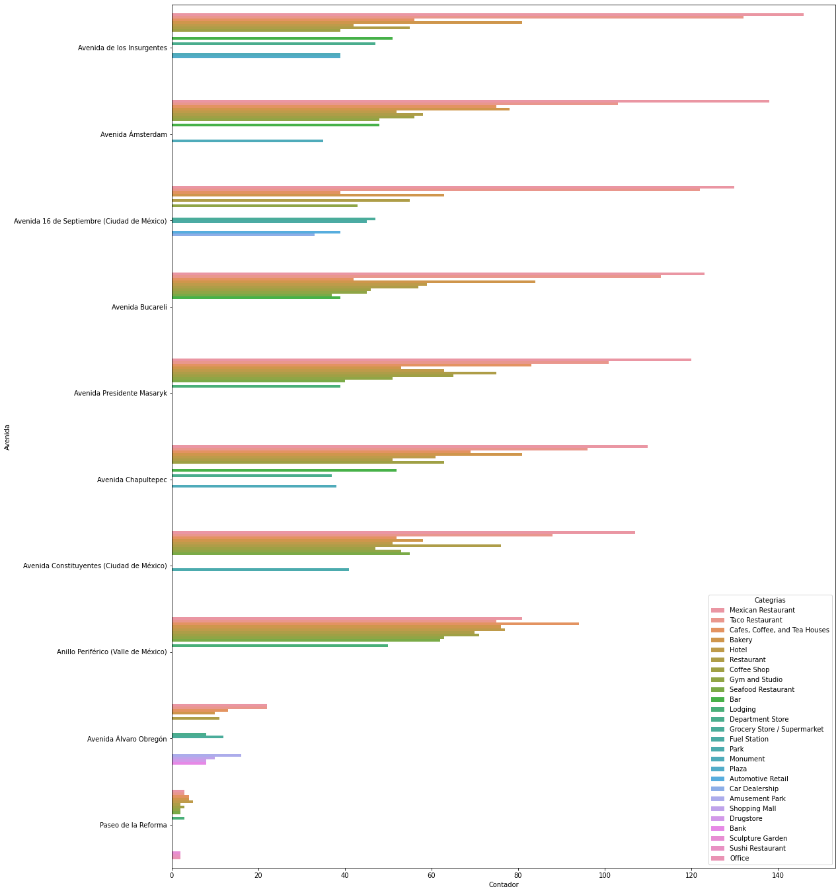

# Proyecto Final
## Propuesta de problema y solución comercial
Por: Israel Agustin Vargas Monroy.  

## Introducción:  
Un gran problema, en el tema comercial, es el lograr encontrar un lugar adecuado para poner en marcha un nuevo negocio. Se vuelve una tarea crucial encontrar la correcta ubicación donde podamos ser fáciles de encontrar, estar cerca de una zona de interés o incluso, definir la cercanía o lejanía con respecto a la competencia comercial. 

Esto se puede ejemplificar en la mayoría de los negocios donde se requiera una interacción directa con los clientes. Pero, para ser más puntuales, este proyecto, se enfocará en encontrar el mejor lugar estratégico para ubicar un nuevo hotel. 

## Problemática:
La empresa Peach Hotel - mejor conocida por su lema: "Best Place to Rest, todo al alcance del hotel". **El objetivo para este año es encontrar el mejor lugar para ubicar su hotel en la Ciudad de México.**  

Se dieron a la tarea de hacer un análisis demográfico, el cuál como resultado les demostró que la mayoría de los huéspedes en sus actuales hoteles, cuando viajan a una metrópoli, le encanta tener zonas turísticas cerca, ya sean parques o avenidas principales conmemorativas de las ciudades. Por otro lado, otro indicador importante es el tener centros comerciales cerca, pues uno de los principales motivos de viaje son las compras. 

Por lo que ahora la tarea ahora es, encontrar zonas con esas características, para poder definir los **top 5 lugares para poder ubicar el nuevo hotel.**

Los criterios para considerar un buen candidato son: 
1. Centros comerciales en un radio no mayor a 1 kilometro.
2. Avenidas principales a no más de 1 kilómetros.
3. Museos y centros culturales en un radio no mayor a 3 kilómetros.
4. Lugares para comer en un radio de 2 kilómetros.

**Por defecto se encontró que la avenida reforma cumple con todas las características,** entonces se requiere de encontrar zonas con las características similares a esta ubicación para poder ser consideradas dentro del top. 

## Solución:
### Fuentes de datos:
**Nuestras fuentes principales para la obtención de información fueron:**       
* **Fourquere:** API de consulta de establecimientos dada una ubicación GPS. [Link a su documentación](https://developer.foursquare.com/reference/place-search).        
* **DENUE - INEGI (Mexico):** API de obtención de establecimientos con base en una categoría ubicada en un punto característico. [Link a su documentación](https://www.inegi.org.mx/servicios/api_denue.html)
* **WIKIPEDIA:** Avenidas principales en la Ciudad de México. [Link de las avenidas](https://es.wikipedia.org/wiki/Categor%C3%ADa:Calles_de_Ciudad_de_M%C3%A9xico).       

### Adquisión de datos:       
1. **Obtener las avenidas principales en la Ciudad de México.** A través de una técnica llamada "webscraping", se realizó una llamada a la página web, una vez obtenida la página, descargaríamos la misma en un formato HTML, el resto fue utilizar la librería de Beatifoulsoup para navegar entre los nodos y obtener las avenidas principales de la ciudad de México.       
2. **Obtención de cordenas características de las avenidas:** Este proceso fue muy manual, a través de Google Maps realizamos la búsqueda de la avenida y obtuvimos las coordenadas GPS.        
3. **Creación de dataframes:**.         
	* **Dataframe DENUE:** Dadas las coordenadas GPS que obtuvimos de cada avenida, decidimos buscar características especiales dentro de la base de datos de la DENUE como restaurantes, hoteles y comercios. Así creamos un dataframe de las avenidas con toda la información por categoría de los establecimientos que se encontraban en un radio de 5 km.          
	* **Dataframe Foursquare:** Una vez obtenido el dataframe de cada avenida, el resto era obtener una búsqueda de establecimientos generales en un radio de 1 km de esos establecimientos. Para ello usamos foursquere, pues nos permitía realizar la búsqueda de manera general.        

### Tratando la información:
Primeramente, la fuente los datos viajaban en formato JSON para ambas APIs, por lo que tuvimos que realizar una función de traducción y selección de llaves-valores para poder crear el dataframe que se requería. 

### Análisis de datos:
Todo el proceso de análisis de datos que se realizo fue meramente frecuencia, un proceso de estadística descriptiva simple, que nos apoyara a entender un contexto genérico de la información obtenida y sobre todo orientarnos al momento de elegir el algoritmo de machine learning a utilizar y su razonamiento al obtener los resultados.   
A continuación, se presentan algunos indicadores importantes que se hallaron al momento de realizar este análisis: 

1. **Categorías más comunes de establecimientos en la Ciudad de México:** Se pudo observar que las categorías genéricas más importantes en las avenidas eran: **Restaurantes, en primer lugar, seguido de cafeterías, museos, librerías, parques y plazas respectivamente**      

2. **Top 20 de las características más importantes en la CDMX:**.       

3. **Top 10 de categorías más importantes por avenida:** Este indicador nos apoyaría mucho a comprender cuales son los establecimientos que más defininen a esa avenida y con ello poder comprender que podemos realizar una reunión de los puntos característicos a traves de sus establecimientos.        

### Algoritmo seleccionado:
* Algoritmo seleccionado: **KMEANS.**
* Justifiación: Requerimos de un algoritmo de clustering, debido a que no conocemos a detalle la interacción entre las avenidas y sus establecimientos, por lo que una técnica no supervisada para la categorización de puntos similares es la que más se ajsuta a esta problemática. Además de que no se cuenta con una variable objetivo, de hecho, al contrario, necesitamos entender, de nuestro punto característico, que clúster le correspondería para poder así determinar las avenidas principales a las cuales consideraremos como candidatas para poner un nuevo hotel.
* Parámetros de creación: 
	1. Grafica de codo: El gráfico nos indica que la mejor cantidad de clúster para nuestros datos son entre 3 o 4 clúster.        

	2. Random state de 0, este parámetro nos ayuda a inicializar los centroides.
	3. Las configuraciones se dejarán por defecto: 300 iteraciones, y el algoritmo será el Kmeans++
* Observaciones:       
	1. PCA: Se trato de visualizar con dos componentes que sean lo suficientemente descriptivas la relación en los puntos. Resulta obvio que el porcentaje de la varianza no es del todo significativo, pero al solo tener 10 muestras, resulta redundante. Solo para términos visualización se utilizó este algoritmo.         

### Resultados:

#### Hoteles:

#### Establecimientos:

**Observaciones:** Dentro de nuestros nuntos de interes el cluster 3 es el cluster de color verde, lo interesante es que el modelo relaciono al mismo cluster nuestro establecimiento característico. Al final hay un mismo hotel de la empresa de hoteles sobre la intersección de la avenida reforma. Es un comportamiento curioso, pero de igual manera puede ser apoyo como validación de nuestro modelo prototipo a su primera iteración.

### Conclusión:   
Puntualmente, necesitamos una mayor cantidad de avenidas para poder evitar una tendencia entre establecimientos. Es decir, prácticamente se tenían los mismos establecimientos característicos en las avenidas, pero había muchos que, con base en la gráfica de distribución de frecuencia de cada categoría, tenían solo 1 en el contador, podríamos filtrarlos o simplemente crecer la muestra de las avenidas para determinar si en verdad son establecimientos únicos y considerarlos como valores atípicos.
En algunos casos, esos establecimientos nos podrían ayudar a poder agregar mayor separación entre los clústeres, pero solo es una hipótesis y se podría considerar en otros experimentos. De igual manera, aunque, el resultado de este algoritmo nos muestra un desempeño correcto para poder determinan una nueva ubicación y colocar un nuevo hotel (sobre la avenida Masaryc, nos indico como clúster 3, y curiosamente, hay otro hotel de la compañía "Hotel Fiesta Americana Grand"), todo es perfectible y podríamos concentrarnos en el problema solo basándonos en la competencia, como lo son los establecimientos con categoría de hotel obtenidos por foursquare.
Por último, se consideró la variable distancia, no se sabia que foursquare en su nueva versión contenía dicha variable por lo que se decidió recolectarla para utilizarla en un siguiente experimento. La hipótesis sería: "¿Los establecimientos más cercanos entre si (de las características principales), apoyarían al modelo a determinar una ubicación más adecuada para un nuevo hotel?".
